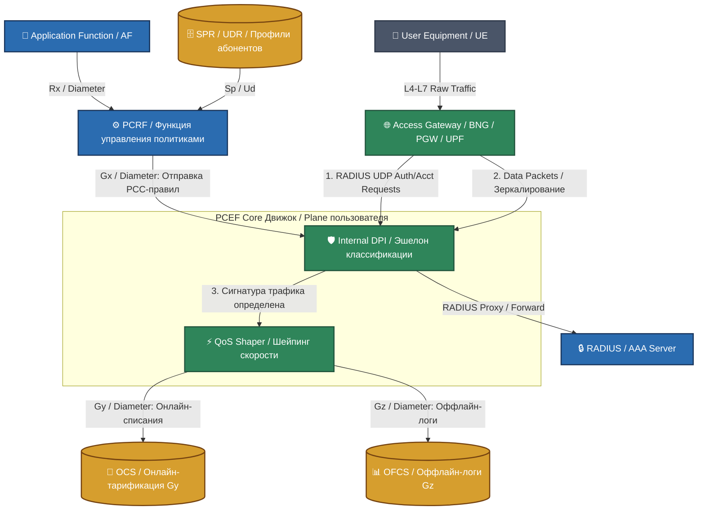

# 🏛️ 3GPP Policy & Charging Enforcement Function (PCEF) Shaper System

[RU] Данный модуль представляет собой высокопроизводительный, коммерческий User Plane движок PCEF (функция применения политик и тарификации) с интегрированным DPI (Deep Packet Inspection) и QoS-шейпером трафика. Архитектура спроектирована по стандартам 3GPP PCC (Policy and Charging Control) для телеком- и финтех-экосистем.

[EN] This module implements a high-performance, production-ready User Plane PCEF (Policy & Charging Enforcement Function) engine featuring an integrated DPI (Deep Packet Inspection) classifier and QoS traffic shaper. Designed strictly according to 3GPP PCC (Policy and Charging Control) standards for telecom and fintech ecosystems.

### Полный разбор: [🚀 docs](./docs/navigation.md)

---

## 🗺️ System Topology & Architecture / Архитектурная топология системы

---

## 📋 Technical Requirements Specification (SRS) / Общее техническое ТЗ проекта

[RU] Нашей b2b-задачей является реализация легковесного, отказоустойчивого эмулятора **User Plane PCEF** на чистом Go, абстрагированного от тяжелого Diameter-сериализатора, но на 100% повторяющего физику обработки L4-L7 фреймов под Highload-нагрузкой.

[EN] Our core objective is to build a lightweight, fault-tolerant **User Plane PCEF** emulator in pure Go. It abstracts away heavy Diameter serialization overhead while perfectly replicating L4-L7 packet processing physics under intense Highload stress.

### 1. Embedded DPI Classifier / Встроенный DPI-классификатор (Req. 1)
* **[RU]** Сервер должен на лету парсить заголовки входящих сетевых пакетов. В рамках демо-кода классификация пакетов осуществляется по сигнатурам (Payload/Host Strings), разделяя трафик на три b2b-категории: `SOCIAL` (мессенджеры), `STREAMING` (тяжелое видео/YouTube) и `GAMING`.
* **[EN]** The engine must parse incoming network packet headers on the fly. In this demo-code scope, classification is driven by payload/host signatures, routing traffic into three distinct b2b categories: `SOCIAL` (messengers), `STREAMING` (heavy video/YouTube), and `GAMING`.

### 2. Credit Control Interface (Gy Sync) / Управление балансом в реальном времени (Req. 2)
* **[RU]** Перед тем как пропустить пакет сквозь QoS-шлюз, PCEF обязан проверить баланс лицевого счета пользователя в OCS. Мы реализуем In-Memory аналог OCS на базе атомарных вычислений. Если у пользователя кончился пакет мегабайт или баланс равен 0, OCS возвращает код отсечки, и PCEF блокирует/срезает трафик.
* **[EN]** Prior to letting a packet through the QoS gateway, the PCEF must evaluate the subscriber's financial balance within the OCS. We implement an in-memory OCS subsystem utilizing atomic operations. If a subscriber exhausts their data quota or reaches a $0$ balance, the OCS returns a cutoff code, forcing the PCEF to throttle or drop the traffic.

### 3. Dynamic QoS Traffic Shaping / Динамический шейпинг скорости (Req. 3)
* **[RU]** Применение политик ограничения скорости должно работать в реальном времени без глобальных блокировок рантайма Go. Мы применим усовершенствованный алгоритм **Leaky Bucket (Протекающее ведро)** для сглаживания всплесков трафика. Скорость пропускания байт (`Bandwidth Limit`) жестко регулируется PCC-правилами, полученными от эмулятора PCRF.
* **[EN]** Bandwidth throttling and traffic shaping must operate in real time without triggering global Go runtime deadlocks. We will deploy an optimized **Leaky Bucket** algorithm to smooth out network traffic spikes. The maximum byte throughput rate (`Bandwidth Limit`) is strictly enforced by PCC rules received from the PCRF emulator.

### 4. Highload Thread Isolation / Потокобезопасность ядра (Req. 4)
* **[RU]** Обработка пакетов должна выполняться параллельными горутинами, утилизирующими все ядра CPU. Мапа сессий абонентов обязана исключать *Mutex Contention*. Мы применим паттерн **Map Sharding (Шардирование мап)** для снижения конкуренции за замки памяти под нагрузкой в сотни тысяч RPS.
* **[EN]** Packet processing must be driven by parallel goroutines utilizing all available CPU cores. The subscriber session map must eliminate *Mutex Contention*. We will deploy the **Map Sharding** pattern to reduce memory lock contention under loads exceeding hundreds of thousands of RPS.

---

## 🏛️ Общий технический разбор эшелонов архитектуры / Deep Architecture Deep Dive

### 1. Эшелон №1: точка входа трафика (Access Gateway, BNG, B_N_G, UPF)
* **Внутреннее устройство и физика процесса:** данный блок является физическим или виртуальным шлюзом терминации абонентских сессий (например, Broadband Network Gateway в фиксированных сетях или User Plane Function в сетях 5G). Он оперирует на уровнях L2/L3 сетевого стека. При подключении устройства пользователя (UE), шлюз инициирует RADIUS-сессию.
* **Протоколы и Взаимодействие:** 
  * `RADIUS UDP (Порты 1812/1813)`: направляет в PCEF Core пакеты `Access-Request` и `Accounting-Request` (Start/Interim/Stop). Внутри пакетов инкапсулированы атрибуты: `Framed-IP-Address` (выделенный IP), `Calling-Station-Id` (MSISDN/Идентификатор абонента) и `3GPP-User-Location-Info` (гео-локация).
  * `Raw IP L4-L7 Traffic`: зеркалирует или пропускает транзитом весь пользовательский трафик (Data Packets) напрямую в движок DPI через сетевые интерфейсы.
* **Выигрыш и Обоснование технологий:** на проде для пиковой пропускной способности интеграция шлюза с PCEF реализуется через технологию **DPDK (Data Plane Development Kit) или eBPF / XDP (Express Data Path)** в ядре Linux. Это позволяет Go-бэкенду забирать пакеты напрямую из кольцевого буфера сетевой карты (`Ring Buffer`), минуя тяжелый сетевой стек ядра Linux и исключая накладные расходы на переключение контекста CPU (*Context Switches*). Выигрыш: обработка пакетов со скоростью сетевой линии (*Line-Rate Processing*).

### 2. Эшелон №2: встроенный движок классификации трафика (Internal DPI Engine)
* **Внутреннее устройство и обработка данных:** получая поток сырых байт от шлюза, DPI (Deep Packet Inspection) не просто смотрит на IP/Порт (как классический L4-файрвол), а заглядывает в тело пакета (*Application Payload*). 
  * Он парсит первые 4-6 пакетов TCP-сессии (Паттерн *SSL/TLS Client Hello*), вытаскивая оттуда поле **SNI (Server Name Indication)**.
  * Если трафик зашифрован и SNI скрыт (TLS 1.3 ESNI), включается эвристический анализатор: проверяются поведенческие паттерны (размеры пакетов, джиттер, временные интервалы между фреймами).
* **Протоколы и Взаимодействие:**
  * `Gx Interface (Diameter RFC 6733 / 4006)`: Асинхронно стучится к **PCRF**, используя уникальный идентификатор абонента (извлеченный из RADIUS). PCRF сверяется с репозиторием профилей (**SPR/UDR**) и возвращает в PCEF набор **PCC-правил (Policy and Charging Control Rules)**. В PCC-правилах жестко зашито: *«Для трафика с сигнатурой YouTube применить квоту Charging-Key=10, для мессенджеров Charging-Key=20»*.
* **Выигрыш и Обоснование технологий:** мапа сессий внутри DPI на Go реализуется через паттерн **Map Sharding (Шардирование)**. Вместо одной глобальной мапы под мьютексом, данные абонентов разбиваются на 256 независимых сегментов: `index = hash(IP) % 256`. Это полностью ликвидирует уязвимость *Mutex Contention* на Highload-нагрузках в сотни тысяч RPS. Выигрыш: Lock-Free чтение сессий абонентов за константное время $O(1)$ со стабильным Latency.

### 3. Эшелон №3: квантование и Онлайн-тарификация (Online Charging System / OCS)
* **Внутреннее устройство и обработка данных:** Движок OCS отвечает за финансовую стабильность платформы. Он работает в режиме реального времени по принципу **Квантования трафика (Quota Reservation)**. PCEF не списывает деньги за каждый байт (это убьет СУБД). Вместо этого PCEF запрашивает у OCS «квант» (резерв) данных — например, пакет размером в 10 Мегабайт. Пользователь качает трафик; как только 10 МБ исчерпаны, PCEF идет за следующим квантом.
* **Протоколы и Взаимодействие:**
  * `Gy Interface (Diameter Credit-Control Application)`: использует команды `CCR (Credit-Control-Request)` и `CCA (Credit-Control-Answer)`. Статусы сессии: `INITIAL` (запрос первого кванта при старте сессии), `UPDATE` (запрос следующего кванта по исчерпании), `TERMINATE` (возврат неиспользованного остатка кванта в OCS при закрытии сессии).
* **Выигрыш и Обоснование технологий:** хранилище балансов квантов переведено на **Aerospike Cluster с гибридной архитектурой памяти (Hybrid Memory Architecture)**. Мы полностью избавляемся от деградации памяти при раздувании кэша и исключаем задержки на репликацию. Операции проверки и декремента квот мегабайт выполняются как атомарные операции Aerospike CDT непосредственно на блочном уровне NVMe-дисков. Выигрыш: Строго предсказуемое Latency под жестким SLA (перцентиль p99 < 1 мс) при нагрузках >500 000 RPS, обеспечивающее стопроцентную финансовую надежность биллинга.

### 4. Эшелон №4: применение политик и Динамический Шейпинг (QoS Shaper)
* **Внутреннее устройство и обработка данных:** Если OCS подтвердил квоту, QoS-шейпер пропускает пакеты с максимальной скоростью согласно тарифу PCRF. Если OCS возвращает статус `DIAMETER_CREDIT_LIMIT_REACHED` (деньги кончились), QoS-шейпер мгновенно переключает стейт-машину абонента:
  * Либо полностью дропает (*Drop*) пакеты пользователя на уровне L3.
  * Либо включает **Traffic Shaping (Шейпинг)**, срезая скорость до гарантированного минимума (например, 64 Кбит/с), чтобы у абонента открывалась только страница пополнения баланса.
* **Протоколы и Взаимодействие:**
  * `Gz Interface (Diameter / File-based)`: асинхронно сливает CDR-файлы (Call Detail Records) и оффлайн-логи объемов скачанного трафика в **OFCS (Offline Charging System)** для последующего долгосрочного b2b-анализа и аудита в ClickHouse.
* **Выигрыш и Обоснование технологий:** алгоритм шейпинга пишется на базе паттерна **Leaky Bucket (Протекающее ведро)** со скользящим окном времени, без создания тяжелых фоновых горутин на каждого абонента (Lazy Refill). Обновление лимитов байт происходит реактивно, только в момент физического прилета сетевого пакета. Выигрыш: микроскопический Memory Footprint рантайма Go. Сервер удерживает миллионы активных QoS-сессий, расходуя считанные мегабайты памяти кучи, полностью защищая ноду от OOM (Out of Memory).

### 1. Tier №1: Traffic Entry Point (Access Gateway, BNG, B_N_G, UPF)

- **Internal Architecture & Physical Process:** This block is a physical or virtual gateway that terminates subscriber sessions (e.g., Broadband Network Gateway in fixed networks or User Plane Function in 5G). It operates at L2/L3 of the network stack. When a User Equipment (UE) connects, the gateway initiates a RADIUS session.
- **Protocols & Interaction:**
  - `RADIUS UDP (Ports 1812/1813)`: Sends `Access-Request` and `Accounting-Request` (Start/Interim/Stop) packets to the PCEF Core. Inside the packets, attributes are encapsulated: `Framed-IP-Address` (allocated IP), `Calling-Station-Id` (MSISDN/subscriber identifier), and `3GPP-User-Location-Info` (geo-location).
  - `Raw IP L4-L7 Traffic`: Mirrors or transparently forwards all user data packets directly to the DPI engine via network interfaces.
- **Technology Advantage & Justification:** In production, for peak throughput, the gateway integrates with PCEF using **DPDK (Data Plane Development Kit) or eBPF / XDP (Express Data Path)** in the Linux kernel. This allows the Go backend to pull packets directly from the NIC’s ring buffer, bypassing the heavy Linux kernel network stack and eliminating CPU context‑switch overhead. **Benefit:** line‑rate packet processing.

### 2. Tier №2: Built‑in Traffic Classification Engine (Internal DPI Engine)

- **Internal Architecture & Data Processing:** Receiving a raw byte stream from the gateway, DPI (Deep Packet Inspection) does not merely look at IP/port (unlike a classic L4 firewall) but inspects the application payload.
  - It parses the first 4–6 packets of a TCP session (e.g., SSL/TLS Client Hello) to extract the **SNI (Server Name Indication)** field.
  - If traffic is encrypted and SNI is hidden (TLS 1.3 ESNI), a heuristic analyzer takes over: behavioural patterns are checked (packet sizes, jitter, time intervals between frames).
- **Protocols & Interaction:**
  - `Gx Interface (Diameter RFC 6733 / 4006)`: Asynchronously contacts the PCRF, using the unique subscriber identifier (extracted from RADIUS). The PCRF consults the subscriber profile repository (**SPR/UDR**) and returns a set of **PCC rules (Policy and Charging Control Rules)** to the PCEF. Each PCC rule rigidly defines: *“For traffic with YouTube signature apply quota Charging‑Key=10; for messengers Charging‑Key=20”*.
- **Technology Advantage & Justification:** The session map inside the DPI is implemented in Go using **Map Sharding**. Instead of a single global map under a mutex, subscriber data is split into 256 independent segments: `index = hash(IP) % 256`. This completely eliminates *mutex contention* under high load (hundreds of thousands of RPS). **Benefit:** Lock‑free, O(1) constant‑time reading of subscriber sessions with stable latency.

### 3. Tier №3: Quota Management & Online Charging (Online Charging System / OCS)

- **Internal Architecture & Data Processing:** The OCS engine ensures the financial stability of the platform. It operates in real time using the **Quota Reservation** principle. The PCEF does not debit money per byte (that would kill the database). Instead, it requests a “quota” (reservation) of data from the OCS – for example, a 10‑megabyte bucket. The user consumes traffic; as soon as the 10 MB is exhausted, the PCEF requests the next quota.
- **Protocols & Interaction:**
  - `Gy Interface (Diameter Credit‑Control Application)`: Uses `CCR (Credit‑Control‑Request)` and `CCA (Credit‑Control‑Answer)` commands. Session states: `INITIAL` (request for first quota at session start), `UPDATE` (request for next quota when exhausted), `TERMINATE` (return unused quota balance to OCS when session ends).
- **Technology Advantage & Justification:** The quota balance storage is moved to an **Aerospike Cluster with Hybrid Memory Architecture**. This eliminates memory degradation due to cache bloat and removes replication delays. Checks and decrements of megabyte quotas are performed as Aerospike CDT atomic operations directly at the NVMe block level. **Benefit:** Strictly predictable latency under hard SLA (p99 < 1 ms) at loads >500,000 RPS, ensuring 100% financial reliability of billing.

### 4. Tier №4: Policy Enforcement & Dynamic Shaping (QoS Shaper)

- **Internal Architecture & Data Processing:** If the OCS confirms the quota, the QoS shaper forwards packets at the maximum rate allowed by the PCRF tariff. If the OCS returns a `DIAMETER_CREDIT_LIMIT_REACHED` status (funds exhausted), the QoS shaper instantly changes the subscriber’s state machine:
  - Either completely drops the user’s packets at L3,
  - Or activates **Traffic Shaping**, reducing the rate to a guaranteed minimum (e.g., 64 Kbps) so that only a balance top‑up page is reachable.
- **Protocols & Interaction:**
  - `Gz Interface (Diameter / File‑based)`: Asynchronously streams CDR (Call Detail Record) files and offline logs of downloaded traffic to the **OFCS (Offline Charging System)** for long‑term B2B analysis and auditing in ClickHouse.
- **Technology Advantage & Justification:** The shaping algorithm is implemented using the **Leaky Bucket** pattern with a sliding time window, without creating heavy background goroutines per subscriber (lazy refill). Byte‑limit updates happen reactively only when a network packet actually arrives. **Benefit:** Microscopic memory footprint for the Go runtime. A server can hold millions of active QoS sessions using only a few megabytes of heap memory, fully protecting the node from OOM (Out‑of‑Memory).