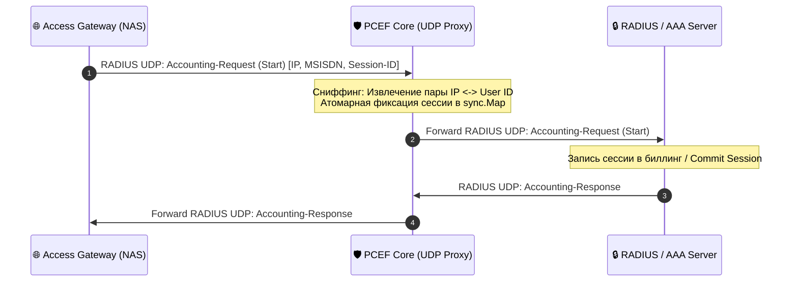

# 🔒 RADIUS / AAA Server Specification

### 🔍 Внутреннее устройство и прием данных / Mechanics & Data Ingestion
* **[RU]** AAA (Authentication, Authorization, Accounting) сервер управляет жизненным циклом сетевого доступа абонентов. Принимает UDP-пакеты от Access Gateway (проксируемые через PCEF Core). Отвечает за проверку b2b-паролей (CHAP/PAP) и выдачу динамических IP-адресов из пула (IPAM).
* **[EN]** The AAA (Authentication, Authorization, Accounting) server governs the network access lifecycle of subscribers. It ingests UDP packets from the Access Gateway (proxied through the PCEF Core). It handles b2b credentials validation (CHAP/PAP) and dynamic IP pool allocation (IPAM).

---

## ⏱️ Перехват RADIUS-сигнализации / RADIUS Signaling Interception Flow

---

### 🛠️ Выигрыш и Обоснование технологий / Technology Justification & Benefits
* **[RU]** **Технология: UDP Socket Multiplexing на Go.** Выигрыш: использование чистых системных вызовов Linux `epoll` и пула горутин-воркеров позволяет обрабатывать RADIUS-сигнализацию со скоростью интерфейса линии, исключая зависания сетевых потоков и гарантируя мгновенную авторизацию сотен тысяч устройств в минуту.
* **[EN]** **Technology: UDP Socket Multiplexing in Go.** Benefits: utilizing raw Linux `epoll` syscalls and a concurrent goroutine worker pool enables processing of RADIUS signaling at wire speed, preventing network thread starvation and guaranteeing instant authorization of hundreds of thousands of devices per minute.
