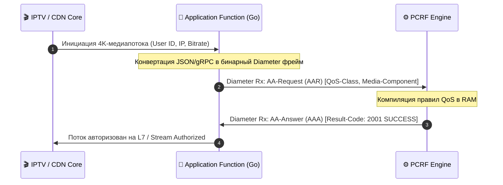

# 🚀 Application Function (AF) Specification

### 🔍 Внутреннее устройство и прием данных / Mechanics & Data Ingestion
* **[RU]** AF представляет собой внешнюю b2b-платформу (например, IPTV-стриминг или CDN), которая инициирует запросы на динамическое выделение полосы пропускания для специфических сессий. Данные принимаются в виде REST JSON/gRPC запросов от бизнес-логики сервисов.
* **[EN]** AF represents an external b2b platform (e.g., IPTV streaming or a CDN node) that triggers dynamic bandwidth allocation requests. Data is ingested via REST JSON/gRPC requests from service business logic.

---

## ⏱️ Поток данных интерфейса Rx / Diameter Rx Data Sequence Flow

---

### 🛠️ Выигрыш и Обоснование технологий / Technology Justification & Benefits
* **[RU]** **Технология: HTTP/2 gRPC -> Diameter Gateway на Go.** Выигрыш: использование пула горутин и неблокирующего I/O (`epoll`) позволяет обрабатывать миллионы b2b-сессий стриминга параллельно с задержкой в пределах <2 миллисекунд, транслируя текстовые API-запросы в ультрабыстрые бинарные Diameter-пакеты.
* **[EN]** **Technology: HTTP/2 gRPC to Diameter Gateway in Go.** Benefits: utilizing a goroutine worker pool and non-blocking I/O (`epoll`) enables parallel processing of millions of b2b streaming sessions with latency under <2ms, translating text-based APIs into ultra-fast binary Diameter packets.
