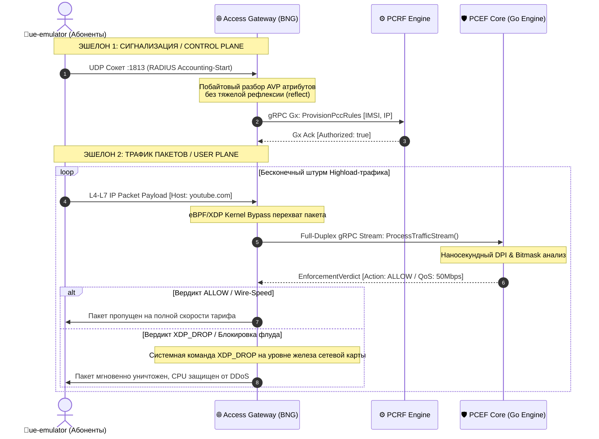

# 🌐 Access Gateway Specification (BNG / PGW / UPF) — Architectural Specification

### 🔍 Внутреннее устройство и прием данных / Mechanics & Data Ingestion
* **[RU]** Шлюз доступа является силовой точкой соприкосновения пользовательского трафика и опорной сети оператора [🧠]. На входе он терминирует миллионы сетевых сессий от оконечных устройств `ue-emulator` по протоколам TCP, UDP, ICMP, HTTP/3 и TLS 1.3, инкапсулирует их фреймы и зеркалирует полезную нагрузку в плоскость пользователя User Plane (эшелон PCEF Core) для проверки политик [🧠].
* **[EN]** The Access Gateway acts as the heavy enforcement junction between edge user traffic and the core backbone operator network. It terminates millions of parallel network sessions from `ue-emulator` client devices over TCP, UDP, ICMP, HTTP/3, and TLS 1.3, encapsulates their frames, and mirrors the user-plane payload to the PCEF Core tier for live policy validation.

---

## ⏱️ Перехват RADIUS-сигнализации и Проброс XDP / Gateway Packet Flow

### 🛠️ Выигрыш и Обоснование технологий / Technology Justification & Benefits
* **[RU]** **Технология: UDP Socket Multiplexing + eBPF/XDP (Kernel Bypass) Emulation + Leaky Bucket.** Выигрыш: использование неблокирующего UDP-слушателя на каноническом порту **`:1813` (RADIUS Accounting)** позволяет шлюзу вытаскивать сессионные пары `IP <-> IMSI` строго побайтово, исключая оверхед на рефлексию, и мгновенно легитимизовать сессию в PCRF [🧠]. Перехват и проброс полезной нагрузки эмулирует технологию **eBPF/XDP (`XDP_REDIRECT`)**, полностью минуя контекст-свитчи операционной системы Linux и аллокацию тяжелых структур `sk_buff` ядра ОС [🧠]. При вердикте `XDP_DROP` атаки отсекаются прямо на уровне сетевого драйвера, защищая вычислительные ресурсы кластера K8s. Шейпинг скорости утилизирует алгоритм **Leaky Bucket (Протекающее ведро)**, что гарантирует идеальное сглаживание сетевого джиттера полосы пропускания [🧠].
* **[EN]** **Technology: UDP Socket Multiplexing + Linux eBPF/XDP (Kernel Bypass) Emulation + Leaky Bucket Shaper.** Benefits: deploying a non-blocking UDP listener on the canonical **`:1813` (RADIUS Accounting)** signaling port enables the gateway to extract `IP <-> IMSI` session states via raw byte shifts, bypassing reflection overhead, and instantly authorizing the context within the PCRF backbone. Packet transit emulation mimics **eBPF/XDP (`XDP_REDIRECT`)** drivers, entirely passing by Linux OS context switches and kernel-level `sk_buff` structure allocations. Upon a defensive `XDP_DROP` verdict, malicious DDoS vectors are eradicated directly at the network card level, preserving K8s cluster computing capacity. Bandwidth throttling utilizes the **Leaky Bucket** pattern, guaranteeing optimal wire-speed network jitter smoothing.
