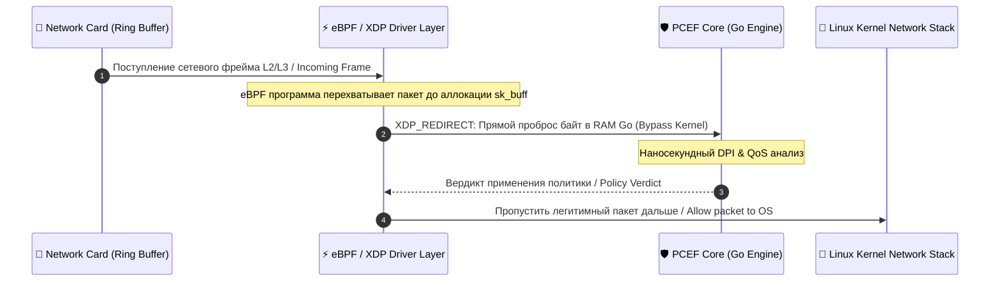

# 🌐 Access Gateway Specification (BNG / PGW / UPF)

### 🔍 Внутреннее устройство и прием данных / Mechanics & Data Ingestion
* **[RU]** Шлюз доступа является силовой точкой соприкосновения пользовательского трафика и опорной сети оператора. Он принимает сырые IP-пакеты от миллионов UE, инкапсулирует их в туннели (GTP-U / GRE) и перенаправляет в плоскость пользователя User Plane (эшелон PCEF) для проверки политик.
* **[EN]** The Access Gateway acts as the heavy enforcement junction between user traffic and the operator's core backbone network. It ingests raw IP packets from millions of UEs, encapsulates them into tunnels (GTP-U / GRE), and re-routes them into the User Plane (PCEF tier) for active policy checks.

---

## ⏱️ Пропуск пакетов через Kernel Bypass / Kernel Bypass Packet Flow

---

### 🛠️ Выигрыш и обоснование технологий / Technology Justification & Benefits
* **[RU]** **Технология: eBPF / XDP (Kernel Bypass) в Linux.** Выигрыш: использование eBPF (Extended Berkeley Packet Filter) позволяет перехватывать и зеркалировать пакеты от Шлюза в наш Go-PCEF прямо на уровне драйвера сетевой карты (`XDP_REDIRECT`), полностью минуя контекст-свитчи операционной системы и аллокацию структуры `sk_buff`. Выигрыш: cпособность утилизировать 100-гигабитные b2b-каналы связи без просадки CPU.
* **[EN]** **Technology: Linux eBPF / XDP (Kernel Bypass execution).** Benefits: deploying eBPF (Extended Berkeley Packet Filter) allows intercepting and mirroring packets from the Gateway into our Go-PCEF directly inside the network card driver layer (`XDP_REDIRECT`), entirely bypassing OS context switches and heavy `sk_buff` allocations. Benefits: ability to saturate 100-Gigabit b2b pipelines with zero CPU starvation.
