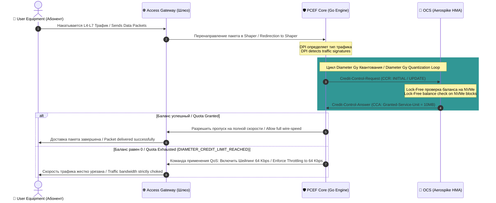

# 💸 Online Charging System (OCS) Specification with Aerospike Engine

### 🔍 Внутреннее устройство и прием данных / Mechanics & Data Ingestion
* **[RU]** OCS — это критический высоконагруженный финтех-сервер реального времени. Он управляет денежными и трафиковыми балансами. В качестве основного In-Memory хранилища применен **Aerospike Cluster**, работающий по гибридной архитектуре (Индексы в RAM, данные сессий напрямую на RAW NVMe блоках). Устройство базируется на паттерне **Резервирования квантов (Quota Allocation)** для снижения транзакционной нагрузки на диски.
* **[EN]** OCS is a critical, ultra-high-load real-time fintech engine managing financial and data balances. It utilizes a distributed **Aerospike Cluster** driven by Hybrid Memory Architecture (primary keys/indices reside in RAM, while session records point directly to RAW NVMe block devices). Its mechanics are built on the **Quota Allocation (Quantization)** pattern to mitigate transactional stress.

---

## ⏱️ Поток данных тарификации / Charging Data Sequence Flow

---

### ⚙️ Обработка и протоколы / Processing & Protocols
* **[RU]** Взаимодействие идет по интерфейсу **Gy (Diameter Credit-Control Application, RFC 4006)**. Движок OCS обрабатывает команды `CCR/CCA`. Использование Aerospike позволяет выполнять атомарные b2b-операции над балансами без блокировки всей таблицы абонентов благодаря механизму **Aerospike CDT (Complex Data Types)** и одношаговым операциям `Write/Increment` на уровне дискового контроллера.
* **[EN]** Interaction flows over the **Gy (Diameter Credit-Control Application, RFC 4006)** interface. It processes `CCR/CCA` command lifecycles. Utilizing Aerospike enables atomic b2b operations on credit balances without sweeping row locks via **Aerospike CDT (Complex Data Types)** and single-step atomic `Write/Increment` mutations at the controller layer.

### 🛠️ Выигрыш и Обоснование технологий / Technology Justification & Benefits
* **[RU]** **Технология: Aerospike Hybrid Memory Architecture (HMA).** Выигрыш: полное исключение оверхеда Сборщика Мусора (No Go/Java GC pauses inside storage). Достигается колоссальная экономия TCO инфраструктуры (до 80% расходов на RAM), так как терабайты данных квот лежат на дешевых NVMe SSD, но извлекаются со скоростью оперативной памяти благодаря прямому доступу ядра к блокам диска.
* **[EN]** **Technology: Aerospike Hybrid Memory Architecture (HMA).** Benefits: complete eradication of Storage-level Garbage Collection pauses. Yields massive infrastructure TCO compression (up to 80% RAM savings) because terabytes of quota logs reside on budget-friendly NVMe SSDs, while being retrieved at near-RAM speeds through raw kernel bypass block access.
