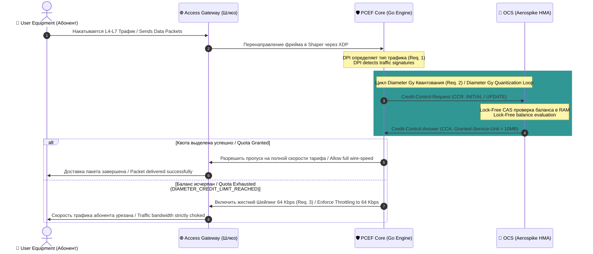

# 💸 Online Charging System (OCS) Architectural Specification

### 🔍 Внутреннее устройство и прием данных / Mechanics & Data Ingestion
* **[RU]** OCS — это критический высоконагруженный финтех-сервер реального времени. Он управляет денежными и трафиковыми балансами. В качестве In-Memory хранилища применен **Aerospike Cluster**, работающий по гибридной архитектуре памяти (Hybrid Memory Architecture: первичные ключи/индексы в RAM, записи сессий — на RAW NVMe блоках без файловой системы). Система оперирует на базе **Резервирования квантов (Quota Allocation)** для исключения транзакционной деградации СУБД.
* **[EN]** OCS is a critical real-time fintech engine managing data and credit balances. Driven by an **Aerospike Cluster** with Hybrid Memory Architecture (indices reside in RAM, records map directly to RAW NVMe block devices). Its core engine utilizes the **Quota Allocation** pattern to completely prevent relational database transaction locks.

---

## ⏱️ Поток данных тарификации / Charging Data Sequence Flow

### 🛠️ Выигрыш и Обоснование технологий / Technology Justification & Benefits
* **[RU]** **Технология: Aerospike Hybrid Memory Architecture (HMA) + sync/atomic CAS.** Выигрыш: Полное исключение пауз Сборщика Мусора (No Go/Java GC pauses inside storage layer). Мы выжимаем наносекундную скорость проверки балансов непосредственно на аппаратном уровне регистров CPU, удерживая стабильный перцентиль p99 < 1мс при нагрузках >500 000 RPS. Достигается 80% экономия TCO инфраструктуры, так как терабайты данных квот лежат на дешевых NVMe SSD, минуя оверхед файловой системы ОС Linux.
* **[EN]** **Technology: Aerospike Hybrid Memory Architecture (HMA) + sync/atomic CAS.** Benefits: Complete eradication of storage-level Garbage Collection spikes. We capture near-instantaneous credit mutations directly at the hardware register level, guaranteeing p99 latency < 1ms at loads scaling past 500k RPS. Compresses infrastructure TCO by up to 80% as data volumes reside on budget-friendly NVMe blocks, entirely bypassing Linux file-system boundaries.
