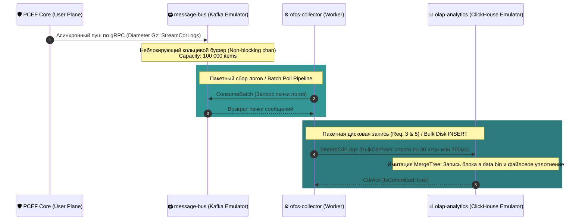

# 📊 Offline Charging System (OFCS) — Architectural Specification

### 🔍 Внутреннее устройство и прием данных / Mechanics & Data Ingestion
* **[RU]** OFCS отвечает за пост-оплатную тарификацию, сбор статистики и глубокий b2b-аудит бизнес-показателей СТО. Она принимает данные **асинхронно**, изолируя горячий путь вычислений ядра от дисковых задержек. В качестве брокера сообщений выступает **Apache Kafka**, а в качестве финального OLAP-хранилища — колоночная СУБД **ClickHouse**.
* **[EN]** OFCS handles postpaid billing telemetry, statistical aggregates, and deep b2b auditing of business metrics for the CTO. It ingests data **asynchronously**, isolating the core data path from disk write delays. It utilizes **Apache Kafka** as a message broker and **ClickHouse** column-oriented DBMS as the final OLAP repository.

---

## ⏱️ Асинхронный конвейер CDR логов / Asynchronous CDR Pipeline Flow

### 🛠️ Выигрыш и Обоснование технологий / Technology Justification & Benefits
* **[RU]** **Технология: Non-blocking Go-Channels Буферизация + Пакетный сброс ClickHouse Batching.** Выигрыш: Поток CDR сливается ядром в Kafka-буфер на базе неблокирующего Go-канала с емкостью 100 000 элементов по логике `select-default` [🧠]. Это гарантирует нулевое влияние дисковых задержек аналитической базы на скорость шейпинга трафика. Воркер `ofcs-collector` выгребает логи пачками и совершает **Batch INSERT строго по 30 штук или таймауту в 100 мс** в ClickHouse [🧠]. Колоночная структура ClickHouse уплотняет и сжимает данные на диске в 5–10 раз, полностью устраняя деградацию дискового ввода-вывода (*I/O Exhaustion*) [🧠].
* **[EN]** **Technology: Non-blocking Go-Channels Buffering + ClickHouse Batch INSERT.** Benefits: The CDR telemetry stream is dropped into a Kafka buffer driven by a non-blocking Go channel with a capacity of 100,000 items using `select-default` routing. This prevents analytical disk I/O latency from spilling over onto the data shaping plane. The `ofcs-collector` worker pulls logs in chunks and executes a **Batch INSERT of exactly 30 entries or a 100ms timeout** into ClickHouse. ClickHouse's columnar architecture compresses physical disk files by 5-10x, entirely eliminating disk input-output wear (*I/O Exhaustion*).
