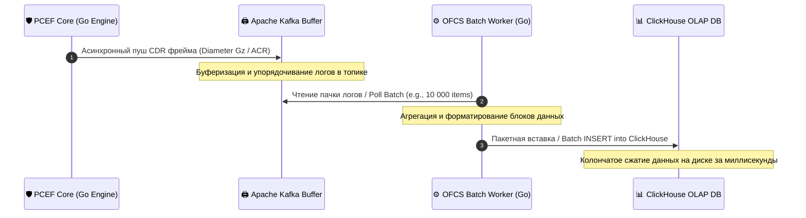

# 📊 Offline Charging System (OFCS) Specification

### 🔍 Внутреннее устройство и прием данных / Mechanics & Data Ingestion
* **[RU]** OFCS отвечает за пост-оплатную тарификацию, сбор статистики и глубокий b2b-аудит бизнес-показателей. Она принимает данные **асинхронно**, в виде потока сырых CDR (Call Detail Records) логов об объемах скачанного абонентами трафика от PCEF Core.
* **[EN]** OFCS handles post-paid billing, statistical aggregates, and deep b2b auditing of business metrics. It ingests data **asynchronously** as a stream of raw CDR (Call Detail Records) files outlining subscriber volumes consumed from the PCEF Core.

---

## ⏱️ Асинхронный конвейер CDR логов / Asynchronous CDR Pipeline Sequence Flow

---

### 🛠️ Выигрыш и обоснование технологий / Technology Justification & Benefits
* **[RU]** **Технология: Apache Kafka + ClickHouse (Column-oriented DB).** Выигрыш: поток CDR сливается в Kafka (буфер), откуда воркеры пачками (*Batching*) записывают данные в ClickHouse. Колончатая структура ClickHouse сжимает логи на диске в 5–10 раз и позволяет СТО выполнять аналитические b2b-запросы по миллиардам строк за миллисекунды.
* **[EN]** **Technology: Apache Kafka + ClickHouse (Column-oriented DB).** Benefits: the CDR stream is dumped into Kafka (buffering), from where workers perform batch writes into ClickHouse. ClickHouse's columnar structure compresses disk logs by 5-10x and enables the CTO to execute analytical b2b queries over billions of rows within milliseconds.
