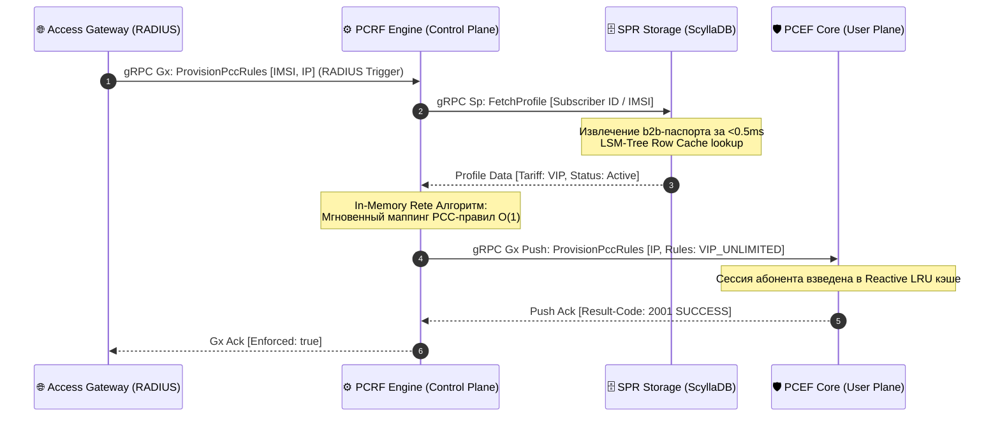

# ⚙️ Policy & Charging Rules Function (PCRF) — Architectural Specification

### 🔍 Внутреннее устройство и прием данных / Mechanics & Data Ingestion
* **[RU]** PCRF является главным «мозгом» плоскости управления (Control Plane). Он принимает транзакционные gRPC-вызовы двух типов: `SendAAQuery` от внешних контент-платформ по интерфейсу **Rx** и `ProvisionPccRules` от Сетевого Шлюза по интерфейсу **Gx** [🧠]. Его основная b2b-задача — динамическая компиляция PCC-правил (Policy and Charging Control Rules) на основе тарифного плана и live-состояния профиля абонента [🧠].
* **[EN]** PCRF functions as the primary brain of the Control Plane layer. It ingests transactional gRPC invokes of two profiles: `SendAAQuery` from external content platforms via the **Rx** interface and `ProvisionPccRules` from the Access Gateway via the **Gx** interface. Its core business milestone is the dynamic compilation of PCC (Policy and Charging Control) rules based on active subscription limits.

---

## ⏱️ Синхронизация политик Gx и Sp / Policy Synchronization Sequence Flow

### 🛠️ Выигрыш и Обоснование технологий / Technology Justification & Benefits
* **[RU]** **Технология: Изолированный Go-модуль (`go.work`) + Table-Driven Policy Mapping.** Выигрыш: Достигается абсолютное разделение ответственности (*Separation of Concerns*) между плоскостью управления и плоскостью пользователя [🧠]. Вместо тяжелых дисковых вычислений или каскадов `if-else`, PCRF прогоняет флаги профиля, полученные из ScyllaDB по протоколу **Diameter Sp**, через внутренний **In-Memory реестр сопоставления правил**. Профиль абонента на лету конвертируется в массив бинарных PCC-правил за время $O(1)$ и по протоколу **Diameter Gx (3GPP TS 29.212)** спускается прямо в оперативную память ядра `pcef-core`, полностью освобождаяUser Plane от накладных расходов бизнес-логики маркетинга [🧠].
* **[EN]** **Technology: Isolated Go Module (`go.work`) + Table-Driven Policy Mapping.** Benefits: Achieves strict, absolute *Separation of Concerns* boundaries between the Control Plane and User Plane layers. Instead of expensive disk-bound evaluations or nested conditional blocks, PCRF evaluates subscription flags retrieved from ScyllaDB via the **Diameter Sp** protocol against its local **In-Memory Policy Mapping Matrix**. The subscriber contract passport is instantly converted into an array of PCC rules within $O(1)$ complexity and pushed via the **Diameter Gx (3GPP TS 29.212)** protocol straight to the runtime memory of the `pcef-core`, completely offloading business-logic execution from the hot data plane path.
