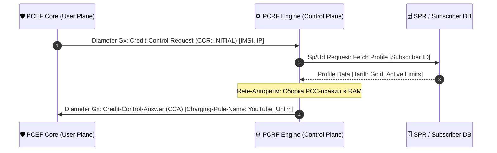

# ⚙️ Policy & Charging Rules Function (PCRF) Specification

### 🔍 Внутреннее устройство и прием данных / Mechanics & Data Ingestion
* **[RU]** PCRF — это «мозг» Control Plane. Он принимает сессионные данные от AF (по Rx) и от PCEF (по Gx). Главная задача — динамическая компиляция **PCC-правил (Policy and Charging Control Rules)** на основе тарифного плана и текущих сетевых политик.
* **[EN]** PCRF is the brain of the Control Plane. It ingests session telemetry from the AF (via Rx) and the PCEF (via Gx). Its core task is the dynamic compilation of **PCC (Policy and Charging Control) Rules** based on the subscriber's tariff and live network conditions.

---

## ⏱️ Синхронизация политик Gx и Sp / Policy Synchronization Sequence Flow

---

### 🛠️ Выигрыш и Обоснование технологий / Technology Justification & Benefits
* **[RU]** **Технология: Rete Algorithm / Движок правил в RAM на Go.** Выигрыш: вместо тяжелых дисковых вычислений правила компилируются в памяти с использованием битовых масок и Lock-Free стейт-машин. Это позволяет менять политику шейпинга абонента на лету за наносекунды при наступлении триггеров (например, наступил час пик — срезаем скорость торрентов).
* **[EN]** **Technology: Rete Algorithm / Memory-resident rule engine in Go.** Benefits: instead of heavy disk-bound computations, rules are compiled in RAM utilizing bitmasks and Lock-Free state machines. This enables changing a subscriber's shaping policy on the fly within nanoseconds upon triggers (e.g., rush hour -> throttle torrents).
