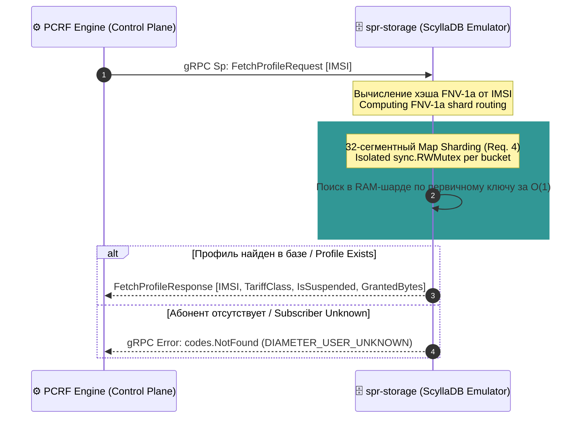

# 🗄️ Subscription Profile Repository (SPR / UDR) — Architectural Specification

### 🔍 Внутреннее устройство и прием данных / Mechanics & Data Ingestion
* **[RU]** SPR (Subscription Profile Repository) представляет собой мастер-базу данных Control Plane плоскости. Она хранит b2b-паспорта контрактов всех абонентов телеком/финтех сети. Данные принимаются в виде gRPC-запросов по интерфейсу **Diameter Sp / Ud** от движка сетевых политик PCRF. Хранилище эмулирует высоконагруженную NoSQL СУБД **ScyllaDB/Cassandra**, использующую архитектуру LSM-деревьев (Log-Structured Merge-tree).
* **[EN]** SPR (Subscription Profile Repository) acts as the master database for the Control Plane tier, preserving b2b contract profiles for all network subscribers. It ingests gRPC queries over the **Diameter Sp / Ud** interface from the PCRF policy engine. The storage layer emulates a high-throughput **ScyllaDB/Cassandra** NoSQL DBMS running on LSM-Tree data structures.

---

## ⏱️ Поток данных извлечения профилей / Profile Retrieval Flow

### 🛠️ Выигрыш и Обоснование технологий / Technology Justification & Benefits
* **[RU]** **Технология: 32-сегментный Map Sharding + sync.RWMutex.** Выигрыш: Архитектура LSM-деревьев ScyllaDB в реальном проде превращает случайные b2b-записи в последовательные, исключая деградацию дисков SSD [🧠]. В нашем Go-эмуляторе базы данных применен паттерн **Map Sharding** на 32 автономных бакета с вычислением индекса через FNV-1a хэширование [🧠]. Это полностью ликвидирует конкуренцию за замки памяти (*Mutex Contention*) под параллельным натиском горутин PCRF-движка, обеспечивая извлечение b2b-паспорта абонента за стабильные наносекунды с использованием неблокирующего конкурентного чтения `RLock` [🧠].
* **[EN]** **Technology: 32-way Map Sharding + sync.RWMutex.** Benefits: Production LSM-Trees morph random database writes into fast sequential sequences, preventing solid-state storage wear. Our Go database emulator deploys a **Map Sharding** pattern over 32 autonomous buckets via FNV-1a hash keying. This completely eradicates RAM *Mutex Contention* under concurrent load spikes from the PCRF engine, guaranteeing subscriber profile retrieval within clean nanosecond bounds using non-blocking parallel `RLock` routines.
