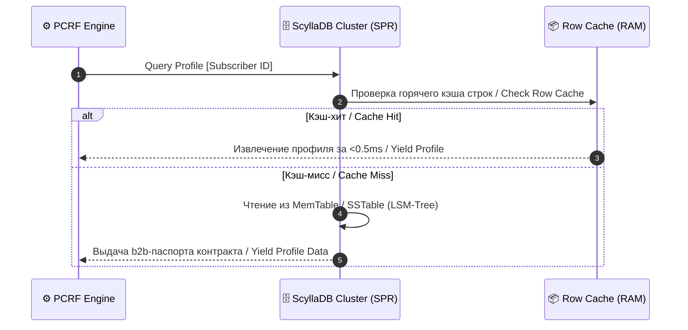

# 🗄️ Subscription Profile Repository (SPR / UDR) Specification

### 🔍 Внутреннее устройство и прием данных / Mechanics & Data Ingestion
* **[RU]** SPR представляет собой мастер-базу данных профилей всех абонентов телеком/финтех сети. Хранит статические и динамические b2b-данные: тарифные планы, подключенные пакеты мегабайт, лимиты овердрафта и флаги блокировок. Принимает запросы на чтение от PCRF.
* **[EN]** SPR represents the master profile database for all subscribers within the telecom/fintech network. It stores static and dynamic b2b telemetry: tariff plans, active data buckets, overdraft limits, and suspension flags. It ingests read queries from the PCRF.

---

## ⏱️ Извлечение профилей / Profile Retrieval Sequence Flow

---

### 🛠️ Выигрыш и обоснование технологий / Technology Justification & Benefits
* **[RU]** **Технология: ScyllaDB / Cassandra NoSQL с LSM-деревом.** Выигрыш: архитектура LSM-деревьев (Log-Structured Merge-tree) превращает случайные записи в последовательные, что обеспечивает стабильную запись миллионов профилей в секунду без деградации дисков SSD. Кэширование горячих строк (*Row Cache*) в RAM обеспечивает чтение за 0.5 миллисекунд.
* **[EN]** **Technology: ScyllaDB / Cassandra NoSQL with LSM-Trees.** Benefits: the LSM-tree (Log-Structured Merge-tree) architecture morphs random writes into sequential ones, guaranteeing stable writes of millions of profiles per second without SSD degradation. Row caching in RAM guarantees read times within 0.5ms.
