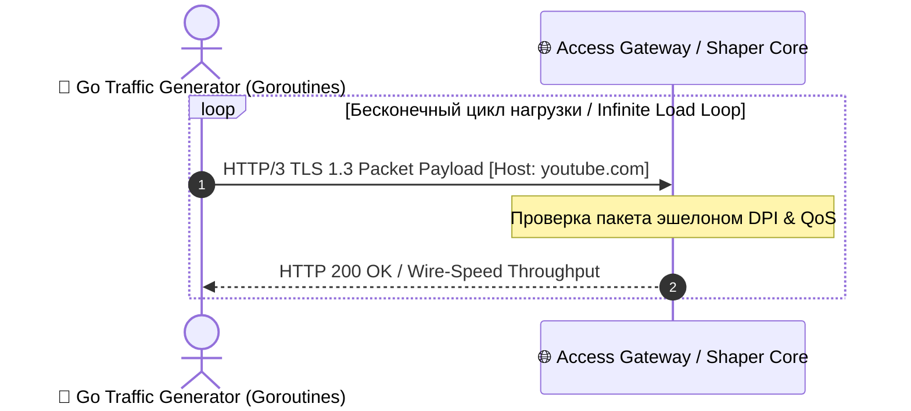

# 📱 User Equipment (UE) Specification

### 🔍 Внутреннее устройство и прием данных / Mechanics & Data Ingestion
* **[RU]** UE представляет собой любое оконечное абонентское устройство (смартфон, IoT-датчик или b2b-терминал), которое генерирует полезную нагрузку. Оно не принимает системные b2b-данные, а является **первоисточником сырого L4-L7 трафика**.
* **[EN]** UE represents any end-user terminal equipment (smartphone, IoT sensor, or b2b terminal) that generates user-plane payload. It does not ingest system metadata, acting purely as the **prime source of raw L4-L7 traffic**.

---

## ⏱️ Конвейер генерации трафика / Traffic Generation Pipeline Flow

---

### 🛠️ Выигрыш и Обоснование технологий / Technology Justification & Benefits
* **[RU]** **В контексте нашего Go-тестирования**: Мы напишем легковесный многопоточный **генератор-эмулятор трафика (Traffic Generator)**. Каждая горутина будет имитировать поведение отдельного UE, бомбардируя наш PCEF Core пакетами разного типа (со случайным джиттером времени). Это позволит нам наглядно замерить пропускную способность (`Throughput`) шейпера на бенчмарках.
* **[EN]** **In our Go testing context**: We will implement a lightweight, highly concurrent **Traffic Generator emulator**. Each goroutine will mimic an independent UE behavior, bombarding our PCEF Core with various packet profiles (utilizing random jitter delays). This will allow us to directly measure the shaper's throughput via performance benchmarks.
